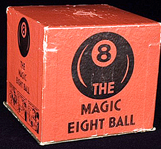

<h1 align="start">
  Волшебный шар
</h1>
<p align="start">
  
</p>

## История и описание
Волшебный шар (англ. Magic 8 ball) - это популярная игрушка, напоминающая внешне бильярдный шар №8. Описание и принцип работы шара указаны [здесь](https://ru.wikipedia.org/wiki/Magic_8_ball)

## Запуск и использование
Перед Вами консольная версия популярной игры, написанная на языке Ruby. Перед запуском игры задумайте закрытый вопрос (требующий ответа "да", "нет", "возможно"), затем в терминале перейдите в папку проекта и наберите следующую команду:
```
$ ruby magic_ball.rb
```
И пусть шар оправдает все Ваши надежды :)
